# Latex准备工作

## Latex安装

- Windows：TEXLive
- MAC：MacTeX（TEXLive）
- 网页版：[overleaf](http://ww.overleaf.com/)

## Latex答疑资料

- 在线手册：[Latex在线手册](http://texdoc.net/)
- 英文社区：[Latex英文社区](http://tex.stackexchange.com)
- 中文社区：Latex工作室

# Latex基础

## 文档构成

* 标题
* 前言/摘要
* 目录
* 正文
  * 篇、章、节、段
    * 文字、公式
    * 列表：编号、无编号、带小标题
    * 定理、引理、命题、证明、结论
    * 程序代码、算法伪码
    * 制表
    * 画图

* 文献
* 索引、词汇表

## 文档基本结构

以**document**环境为界：

- document前为导言，进行格式的设置
- document内部为正文，套用格式
- document后忽略

如：简单文档

~~~latex
%导言：格式设置
\documentclass{ctexart}
\usepackage[b5paper]{geometry}
%正文：填写内容
\begin{document}
\latex
\end{document}
~~~

## Latex语法结构

1. 命令：\ + 命令 + [可选参数] + {参数1} + {参数2}

   如：`\frac{1}{2}`，输出为1/2

2. 环境：\begin{env}

   ​			...

   ​			\end{env}

   如：`\begin{matrix}...\\...\end{matrix}`，为矩阵的输入格式

3. 注释：以`%`开头，注释该行在%后的内容。

## 导言部分

### 设置文档类型和纸张

~~~latex
\documentclass[纸张](文档类型)
文档类型：article,book,report,letter
纸张：a4paper,11pt（字号）,...
~~~

### 导入宏包

~~~latex
\usepackage{ctexart}%中文文档
\usepackage{times}% 使用 Times New Roman 字体
\usepackage{color}% 支持彩色
\usepackage{indentfirst}% 首行缩进宏包
~~~

### 设置文档性质

~~~latex
\title：设置文档标题；有一个参数，用大括号跟在后面，表示标题内容
\author：设置文档作者；一个参数
\date：设置日期；其中\today表示系统当天日期，也可以手动输入；留空的话则不排版日期
\name:作者名
\address:通信地址和联系方式
\maketitle：写在正文区的命令，排版标题；这个命令如果不使用，之前设置的标题、作者、日期都是不会出现在成品中的；使用它之后会排版标题、作者和日期。
~~~

## 正文部分                  

一个换行符等同于一个空格，多个空格等同于一个空格；空一行是分段

### 插入章节与目录

| 层次 |     名称      |      命令      |                说明                |
| :--: | :-----------: | :------------: | :--------------------------------: |
|  -1  |     part      |     \part      |            可选的最高层            |
|  0   |    chapter    |    \chapter    |        report，book类最高层        |
|  1   |    section    |    \section    |          article类最高层           |
|  2   |  subsection   |  \subsection   |                                    |
|  3   | subsubsection | \subsubsection | report，book类默认不编号，不编目录 |
|  4   |   paragraph   |   \paragraph   | report，book类默认不编号，不编目录 |
|  5   | subparagraph  | \subparagraph  | report，book类默认不编号，不编目录 |

`\section{title}`等不带*的命令均带编号，如果要生成不带编号的章节标题要使用`\section*{title}`命令，`\section{}`可以带`\label`方便后续说明。

~~~latex
\tableofcontents %生成目录
~~~

### 正文符号

|      命令       | 符号 |
| :-------------: | :--: |
|       \\#       |  #   |
|       \\$       |  $   |
|       \\%       |  %   |
|       \\&       |  &   |
|       \\{       |  {   |
|       \\}       |  }   |
| \\textbackslash |  \   |
|       ...       | ...  |

更多符号使用查看符号字体包：[symbols文档](https://www.caam.rice.edu/~heinken/latex/symbols.pdf)

### 列表

~~~latex
%列表环境
\usepackage{enumerate}

%编号1. 2.
\begin{enumerate}%默认输出格式
\item a
\item b
\end{enumerate}
%编号(1) (2)
\begin{enumerate}[(1)]
\item a
\item b
\end{enumerate}
%其他格式还有i),1)等

%无编号
\begin{itemize}
\item a
\item b
\end{itemize}
~~~

### 数学

#### 数学公式

* 行内公式

  使用一对$$来标示，如`$a+b=c$`，得到a+b=c

* 显示公式
  1. 不编号公式使用`\[`和`\]`来标示
  2. 编号的公式使用`\begin{equation} ... \end{equation}`来标示
  3. 更为复杂的结构，使用**amsmath**宏包提供的专门数学环境，主要是对齐的数学公式

#### 数学结构

* 上标与下标：`^`与`_`

* ~~~latex
  %上下画线
  \overline{abc}
  \underline{abc}
  %上下花括号
  \overbrace{abc}
  \underbrace{abc}
  ~~~

* 分式：`\frac{分子}{分母}`

* 根式：`\sqrt[次数]{根号下}`

* 矩阵：使用**amsmath**宏包提供的专门矩阵环境**matrix，pmatrix，bmatrix**等，特别复杂的矩阵使用**array**环境作出表格画出

* 其他如下：

  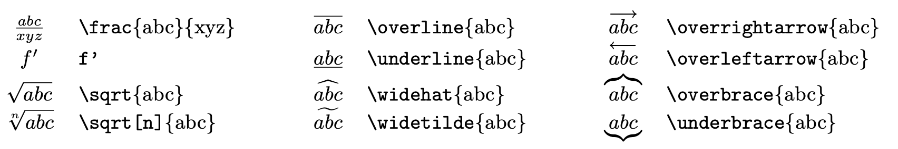

#### 数学符号

* 数字字母：

  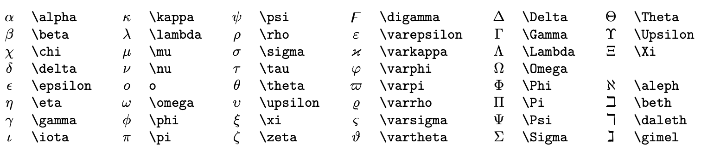

* 数学公式：

  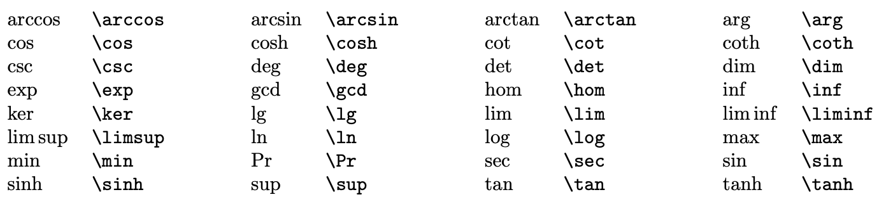

* 括号和分隔符：

  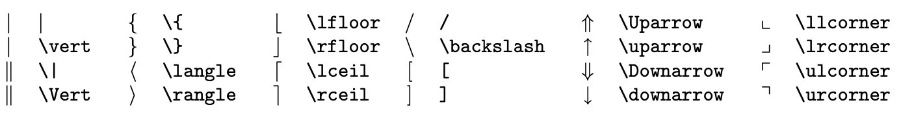

  ​			**使用`\left`s1和`\right`s2对将分隔符s1和s2的高度与其内容的高度匹配**

* 二元运算符：

  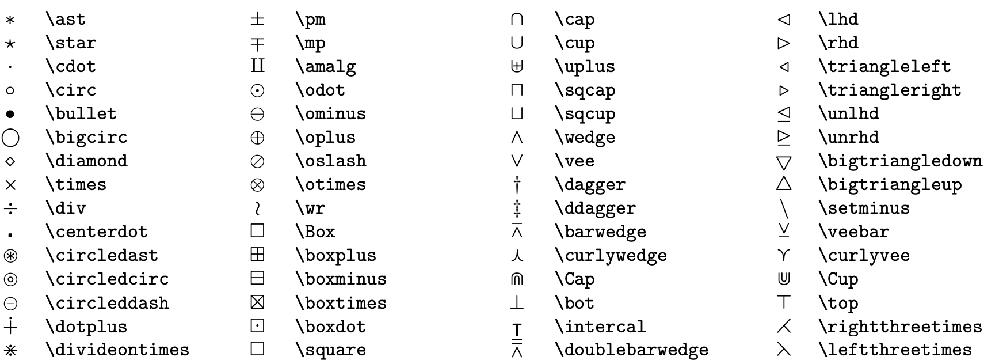

* 二元关系符：

  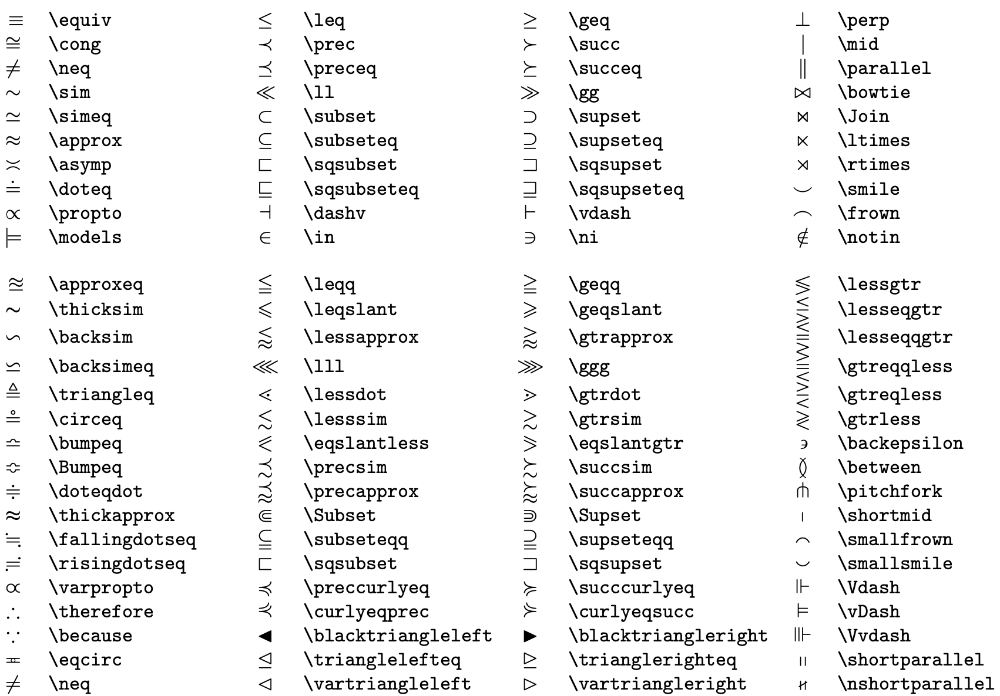

  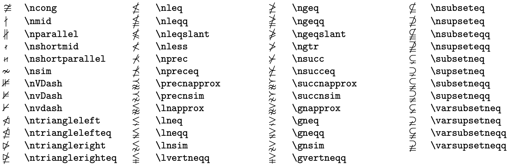

* 可变大小的运算符

  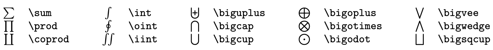

  

* 数学字体

  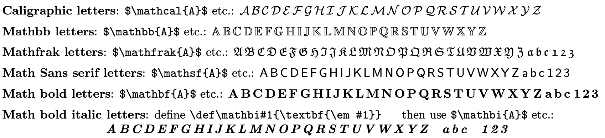

* 字体大小

  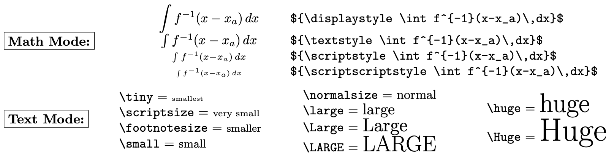

  
  
  ​		使用\big，\Big，\bigg，\Bigg分别控制数学公式中的单个括号的大小，从左到右为从小到大。
  
  ​		使用\left和\right可以得到与括号内内容接近的括号，如下对于分数的包装：
  
  ~~~latex
  \begin{equation}
  (\frac{1}{b})
  \end{equation}
  
  \begin{equation}
  \left(\frac{1}{b}\right)
  \end{equation}
  ~~~
  
  分别得到：
  
  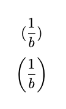
  
  

#### 定理环境

~~~latex
\newtheorem{thm}{Theorem}[Chapter]%定义一个以Theorem为标题的thm环境,计数以章节为主.

\begin{thm}
定理
\end{thm}
~~~

### 代码/算法

#### 插入代码

~~~latex
%命令：
\verb|代码|
%环境：
\begin{verbatim}
命令
\end{verbatim}	
%其他高级设置使用listings或minted宏包
~~~

#### 插入算法

使用clrscode，algorithm2e或algorithmicx中的algpseudocode格式宏包

### 表

[表格生成网站](http://www.tablesgenerator.com/latex_tables)

~~~latex
\begin{table}[htbp]%浮动体：htbp为浮动格式,h为当前位置，t为顶部，b为底部，p为浮动页，优先满足排在前面的格式
	\centering  % 显示位置为中间
	\caption{standard table}  % 表格标题
	\label{table1}  % 用于索引表格的标签
	\begin{tabular}{cccc}%里面的字母个数代表列数，l左对齐，r右对齐，c居中，|代表是否画竖分隔线
		A & B & C & D \\ %&代表一列，\\代表换行
		\hline %代表横分隔线
		A & B & C & D \\
	\end{tabular}
\end{table}

% *占两列，无则一列
\begin{table*}
\end{table*}

%三线表
\usepackage{booktabs}
\toprule % 表格最上线(粗)
\midrule % 表格中线(粗)
\bottomrule % 表格最下线(粗)
~~~

### 图

~~~latex
\begin{figure}[htbp]%将图的代码放在一个浮动体中
  \centering %图片居中
  %\flushleft 左对齐
  %\flushright 右对齐
  \includegraphics[width=\columnwidth]{overview.pdf}%[]设置图片宽度，{}选择文件
        % [width=\textwidth]页面宽度    [width=\columnwidth]栏宽    [width=8.2cm]实际宽度   [width=0.75\textwidth]0.75倍宽度
        % [scale=1] 与原文件比例为1
        % [angle=90] 将图像旋转90度
  \caption{Overview}%图片标题
  \label{fig:pipeline}  %用于索引图片的标签
\end{figure}

% *占两栏，无则一栏
\begin{figure*}
\end{figure*}
~~~

### 浮动体

用于在其中将绘制的表格或图片漂浮在文中，详细用法见上两节；其中可以定义图表的标题`\caption`，标签`\label`等。

### 自定义命令

~~~latex
%\newcommand————定义命令
%命令只能由字母组成，不能以\end{}
%\newcommand<命令>[<参数个数>][<首参数默认值>]{<具体的定义>}
 
%\newcommand可以是简单的字符床替换%
%使用\PRC 相当于 People's Republic of \emph{China}%\emph为强调
\newcommand\PRC{People's Republic of \emph{China}}
 
%\newcommand也可以使用参数
%参数的个数从1到9，使用时用 #1，#2，#3......#9表示
\newcommand\loves[2]{#1 喜欢 #2}
\newcommand\hatedby[2]{#2 不受 #1 喜欢}
 
%\newcommand参数也可以有默认值
%指定参数个数的同时指定首个参数的默认值，那么这个命令的
%第一个位置参数就成为可选的参数（要使用中括号指定）
\newcommand\love[3][喜欢]{#2 #1 #3}
 
%\renewcommand————从新定义已有的命令
%用法与\newcommand类似
 
 
%正文区
\begin{document}
	\PRC
	\loves{小猫}{鱼}
	\hatedby{小猫}{萝卜干}
	\love{小猫}{鱼}
	\love[最爱]{小猫}{鱼}%注意如果要修改默认参数，要用[]
\end{document}

% 图表引用命令修改
\newcommand{\figref}[1]{Fig.~\ref{#1}}
\newcommand{\tabref}[1]{Tab.~\ref{#1}}   % 引表格，与\label{tab:tab1}相对应
\newcommand{\equref}[1]{Equ.~(\ref{#1})}  % 引图片，与\label{fig:pipeline}相对应
\newcommand{\secref}[1]{Sec.~\ref{#1}}
~~~

得到：

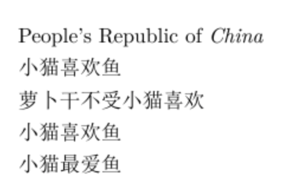

### 超链接

~~~latex
%% 超链接
\usepackage{hyperref}
\url{https://dfew-dataset.github.io/}
~~~

### 参考文献

正文部分所引用的参考文献均出自.bib文件中。（如何写.bib文件请自行百度）

.bib文件中内容如下：

~~~latex
@article{ref1,
  title={Dynamic texture recognition using local binary patterns with an application to facial expressions},
  author={Zhao, Guoying and Pietikainen, Matti},
  journal={IEEE transactions on pattern analysis and machine intelligence},
  volume={29},
  number={6},
  pages={915--928},
  year={2007},
  publisher={IEEE}
}
~~~

正文引用使用`\cite{.bib文件中引用论文的名称，如ref1}`

正文末尾使用`\bibliography{bib文件的前缀}`从.bib文件中自动读取所引用内容

**注意**：生成参考文献需要首先使用**LaTex**编译执行文件，生成.aux文件等，再使用**BibTex**编译执行文件，后再执行两次**LaTex**

​			参考文献引用格式由.bst文件决定。

